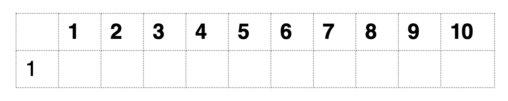
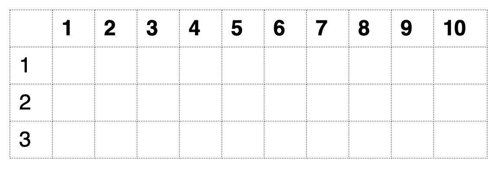

## For independent practice

- Download R from [r-project.org](https://www.r-project.org/)
- Download RStudio IDE from [rstudio.com](https://www.rstudio.com/products/rstudio/download/)

## Where is everything in RStudio?

- Source 
- Console
- Environment, History
- Files, Plots, Packages, Help, Viewer

## What can do you in R
- [Make interactive documents](http://timelyportfolio.github.io/rCharts_nyt_home_price/)
- Build web-based applications
  - [CDC data](https://gallery.shinyapps.io/CDCPlot/)
  - [Malaria simulations](https://econometricsbysimulation.shinyapps.io/Dynamic-Pro/)
  - [Riboviz](https://riboviz.org/GeneBased.html)
- Presentations (including PowerPoint presentations)
- [Write books and papers](https://bookdown.org/yihui/bookdown/)

## Working with R Notebooks
- [RMarkdown](https://rmarkdown.rstudio.com/lesson-1.html)
- Code chunks

## R - a powerful calculator

## Variables in R

### Assign values to variables

### See the current value of variable

### Operate directly on variables

### Naming conventions
  - DO NOT start with a number (1xyz, 4abc, etc.)
  - Numbers after characters are OK (variable1, variable2, etc.)
  - Be descriptive. Use `tab` to autofill
  
### Save output of operations to new variables

### Assigning new values to existing variables

## Logical operators (==, <, >, !, &, |)

## Exercise 1.1 (Question, Code, Answer)
1. Create three variables and check if either of the first two variables are greater than the third.
2. Create three variables and check if the sum of the first two variables is greater than the third variable.
3. Create four variables and check if the product of the first two variables is the same as the product of the last two variables.

## Types of variables

## Exercise 1.2 (Question, Code, Answer)
1. What results when you add `TRUE` variable with a numeric?
2. What results when you multiply `FALSE` with an integer?
3. What results when you add `NA` to numeric?
4. If I am driving at a speed of 62 MPH (miles per hour), how long will it take me to drive from Philadelphia to New York City (94 miles)? How long will it take me for the reverse commute if I drive at 40 MPH?
5. Write a code to calculate the area and circumference of a circle with radius 2 meters.

## Simple data structures

- **Vector** (one-dimension)

- **Matrix** (two-dimensions)

- **Arrays** can have more than 2 dimensions
- A **Vector** is a one dimensional **Matrix/Array**
- All elements of a **Vector/Matrix/Array** have to be of the same type/class

### Some useful functions
- Functions are followed by parentheses
```{r, eval=FALSE}
# Function to create or combine elements 
c()

# Function to add values
sum()

# Function to plot
plot()
```

### Create simple vectors
- Numeric, character, and logical

### Accessing elements of a cector
- Understanding an _index_, and _reference_ to an index

## Exercise 1.3 (Question, Code, Answer)

1. Find the sum of the first and the last element of a vector.
2. Create two numeric vectors of length 3 and combine them into a third vector.
3. What happens when you combine a character vector with a numeric vector?
4. Create two numeric vectors of length 3. Create a new vector with ONLY the second elements of both vectors.
5. What happens when you _reference_ an index outside the length of a vector?
6. What happens when you _reference_ a negative index?
7. What happens when you add two numeric vectors of the same length?
8. What happens when you add two numeric vectors of the different lengths?
