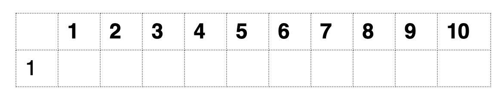

## Types of variables

## Exercise 3.1 
1. What results when you add `TRUE` variable with a numeric?
2. What results when you multiply `FALSE` with an integer?
3. What results when you add `NA` to numeric?
4. If I am driving at a speed of 62 MPH (miles per hour), how long will it take me to drive from Philadelphia to New York City (94 miles)? How long will it take me for the reverse commute if I drive at 40 MPH?
5. Write a code to calculate the area and circumference of a circle with radius 2 meters.

## Simple data structures

- **Vector** (one-dimension)

- **Matrix** (two-dimensions)

- **Arrays** can have more than 2 dimensions
- A **Vector** is a one dimensional **Matrix/Array**
- All elements of a **Vector/Matrix/Array** have to be of the same type/class

## Some useful functions
- Functions are followed by parentheses
```{r, eval=FALSE}
# Function to create or combine elements 
c()

# Function to add values
sum()

# Function to plot
plot()
```

## Create simple vectors
- Numeric, character, and logical

## Named vectors

## Accessing elements of a cector
- Understanding an _index_, and _reference_ to an index

## Exercise 3.2 

1. Find the sum of the first and the last element of a vector.
2. Create two numeric vectors of length 3 and combine them into a third vector.
3. What happens when you combine a character vector with a numeric vector?
4. Create two numeric vectors of length 3. Create a new vector with ONLY the second elements of both vectors.
5. What happens when you _reference_ an index outside the length of a vector?
6. What happens when you _reference_ a negative index?
7. What happens when you add two numeric vectors of the same length?
8. What happens when you add two numeric vectors of the different lengths?

## Subset a vector
- Using indices
- Using names
- Using other vectors
- Using logical variables/vectors

## Sequence function
- What if you have a really large vector of say 100 or even 1000 elements?
- What about a vector of only even numbers between 1 and 100?

## Exercise 3.3
1. From the vector of all numbers (1 to 100), create a new vector with only multiples of 5.
2. Create a vector of all multiples of 10 between 1 and 100 in DECREASING order?
3. What values are in the 3rd and 7th element of the above vector?

## Repeat function
- How would you create a vector of 100 1s?

## Exercise 3.4
Create the following vectors


## Creating a matrix

## Accessing elements of a matrix
