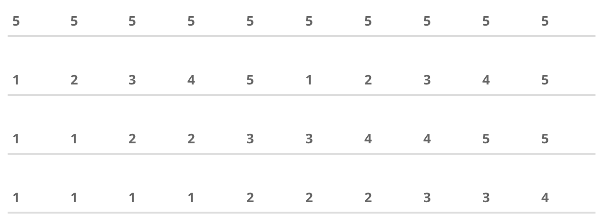

## Exercise 3.3
1. From the vector of all numbers (1 to 100), create a new vector with only multiples of 5.
2. Create a vector of all multiples of 10 between 1 and 100 in DECREASING order?
3. What values are in the 3rd and 7th element of the above vector?

## Exercise 3.4
Create the following vectors


## Matrix


### Creating a matrix

### Accessing elements of a matrix

### Subsetting a matrix into vectors

## Dataframes
- What if you wanted different _types_ of data in each column?

### Creating a data frame

### Accessing and subsetting data frames
- Like a matrix
- Using column names

## Reading external files

### Working with vectors and data frames
```{r, eval=FALSE}
# Length gives you number of columns
length()

# Dimensions of a data frame
dim()

# Number of rows of a data frame
nrow()

# Number of columns of a data frame
ncol()

# Identify type of objects
class(my_data)

# Structure of a data frame
str()

# Summary functions
min()
max()
mean()
sd()

# Summarize data in all columns
summary()

# Check the type of data in a column
is.logical()
is.numeric()
is.na()
```

## Exercise 4.1
1. Create a new data frame which contains only the first three columns of the old data frame.
2. How many observations have __new_cases__ values in them?

## Vectorized operations (detour)

## Locating and extracting values
- Using logical variables
- __which__ function
- __%in%__ function

## Exercise 4.2
1. How many observations are there for the United States in the data frame?
2. Which country has the lowest median age? 
3. Describe any one way to check if the country with the oldest median age has a higher number of average new_cases than the country with the lowest median age.