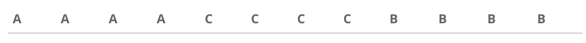
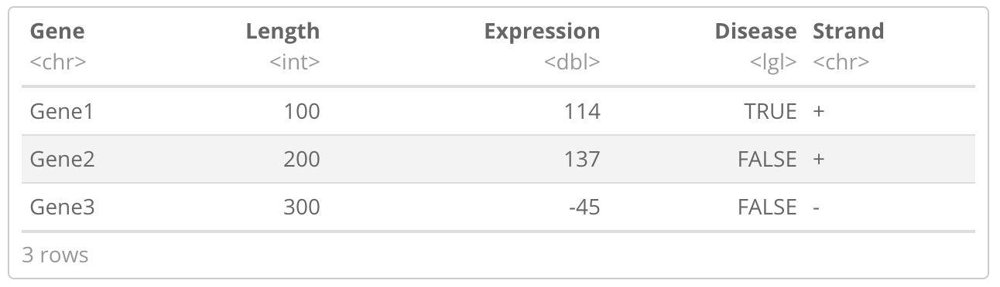

## Instructions
- **Each question is 1 point.**
- **Type your name in the Author section above**
- **Write the `codes` for all questions in this R Notebook (file).**
- **ALWAYS comment your code.**

## Questions
1. Create two character vectors of length 3. Create a new combined vector EXCLUDING (without) the second elements of both vectors.
2. Create a vector of all multiples of 8 between 10 and 100 in DECREASING order?
3. Create any 3x3 numeric matrix. Create a vector of sums of elements in each row using two different methods.
4. Create a named numeric vector of numbers 1 through 6. The names of elements of this vector should be A through F.
5. & 6. Create the following vectors using `rep` function

7. Create a new data frame shown below. Pay close attention to the type of data in each column.

8. What does the function `dim()` do? What kind of data objects can you apply this function to? What happens when you apply `dim()` to a vector?

Read in the quiz_data.csv file and answer the following

9. How many observations have missing data for `new_tests`?

10. Subset this data frame to create a new data frame with only the following columns - `location`, `month`, `date`, `new_cases`, and `new_deaths`.

11. (Extra credit 1 pt.) How many observations have `Canada` in the `location` column?
